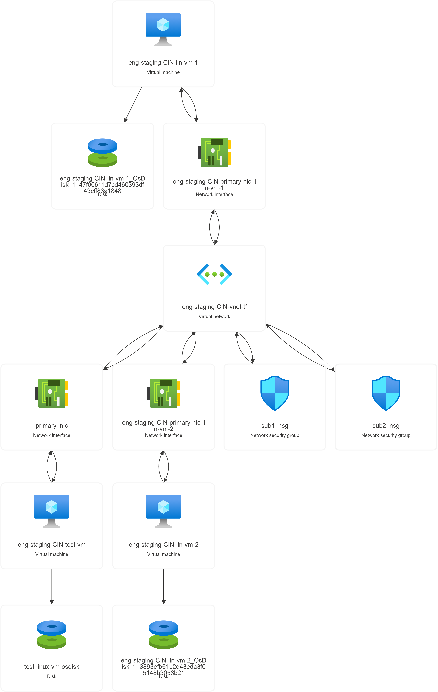

# Azure Linux VM Deployment using Terraform

This Terraform configuration demonstrates the creation of Azure Linux Virtual Machines (VMs) inside a Virtual Network (`eng-vnet`) using two approaches:

- **Single VM Deployment** — using a standard resource block.
- **Multiple VMs Deployment** — using the `for_each` meta-argument to dynamically provision multiple instances from a map variable.

## Operating System

All virtual machines are deployed with **Ubuntu 22.04 LTS** as the operating system.

## Topology Overview

The following architecture diagram represents the infrastructure components provisioned by this Terraform configuration:

### Components

- **Virtual Machines**
  - `eng-staging-CIN-test-vm`: A standalone Ubuntu VM.
  - `eng-staging-CIN-lin-vm-1`, `eng-staging-CIN-lin-vm-2`: Multiple Ubuntu VMs created using the `for_each` meta-argument.

- **Network Interfaces**
  - Each VM is associated with a dedicated NIC, named uniquely per instance.

- **Disks**
  - OS disks are created automatically for each VM.

- **Network Security Group**
  - A Linux-specific NSG is created and associated with each NIC to allow secure access (e.g., SSH).

- **Virtual Network**
  - All VMs are provisioned within the `eng-vnet` virtual network and assigned to a designated subnet.

## Files Included

- `main.tf` — Core logic for VM and networking resource creation.
- `variables.tf` — Declares all input variables.
- `outputs.tf` — Captures output values like public IPs, VM names, etc.
- `terraform.tfvars` — Sample input values used during deployment.
- `eng-staging-CIN-tf-rg.png` — Topology diagram (shown above).

## Notes

- This example uses **Password authentication** only (no SSH Key login).
- All resources are created in a flat structure (no module usage).
- Ensure you run `terraform init` before apply.
- Designed for test/staging purposes — consider hardening for production.

---

Feel free to adjust for region, tags, or additional resources as your project evolves.
