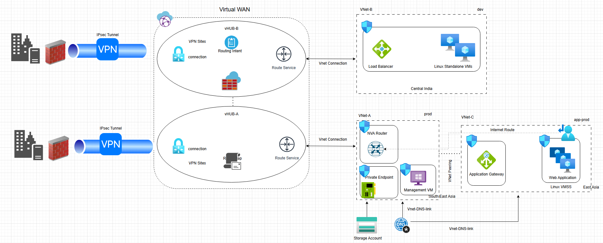

# README: Azure Virtual WAN Architecture

## Overview

This document provides an overview of the Azure Virtual WAN (vWAN) based network architecture as depicted in the provided diagram. The design integrates multiple VNets, Virtual WAN hubs, VPN connections, and application delivery components for a hybrid cloud setup.

## Architecture Components

### 1. On-Premises Connectivity

- On-premises sites connect to Azure through **IPsec VPN tunnels**.
- Each site establishes secure VPN connectivity to the Azure Virtual WAN hubs (vHUBs).

### 2. Azure Virtual WAN

- The central hub for network traffic distribution.
- **vHUB-A**:
  - Hosts Route Service and VPN connectivity.
  - Connected to **VNet-A** (prod).
- **vHUB-B**:
  - Provides Routing Intent and Firewall Service.
  - Connected to **VNet-B** (dev).

### 3. VNet-A (Prod, South/East Asia)

- Contains key infrastructure components:
  - **NVA Router**: Custom routing device.
  - **Private Endpoint**: Secure access to Azure PaaS services.
  - **Management VM**: Administrative access and monitoring.
  - Linked with a **Storage Account** and **DNS** service through VNet DNS links.

### 4. VNet-B (Dev, Central India)

- Contains development environment resources:
  - **Load Balancer** distributing traffic across Linux standalone VMs.

### 5. VNet-C (App-Prod, East Asia)

- Dedicated to production application workloads:
  - **Application Gateway**: Provides load balancing and WAF capabilities for the web application.
  - **Linux VMSS**: Hosts scalable production web applications.
  - Internet-bound traffic routed through configured **Internet Route**.

### 6. Inter-VNet Connectivity

- **VNet Peering** is established between **VNet-A** (prod) and **VNet-C** (app-prod).
- **VNet DNS link** enables DNS resolution across VNets.

## Traffic Flow Summary

1. On-premises users connect to Azure via VPN tunnels terminating at vWAN hubs.
2. vHUBs distribute routes and enforce routing intent/firewall policies.
3. Development workloads are hosted in **VNet-B**, while production workloads run in **VNet-C**.
4. Application Gateway in VNet-C routes traffic to Linux VMSS hosting web applications.
5. Administrative traffic is directed to **VNet-A**, where the Management VM and Private Endpoints are located.

## Key Features

- **Hybrid connectivity** with on-premises VPN integration.
- **Segregated environments** for dev, prod, and app-prod workloads.
- **Centralized routing and security** via Azure Virtual WAN hubs.
- **Application delivery optimization** with Application Gateway and Load Balancer.
- **Scalable compute** using Linux VMSS.
- **Secure access to Azure services** with Private Endpoints.

## Potential Use Cases

- Multi-region, production-grade enterprise workloads.
- Hybrid applications requiring both on-prem and cloud integration.
- Environments with strict routing and security enforcement.

---

## Next Steps

- Implement Terraform/ARM templates for deployment automation.
- Configure monitoring and logging for vWAN hubs, NVAs, and App Gateway.
- Define routing policies for east-west and north-south traffic control.

---

**Author:** Cloud Architecture Team  
**Last Updated:** August 2025

