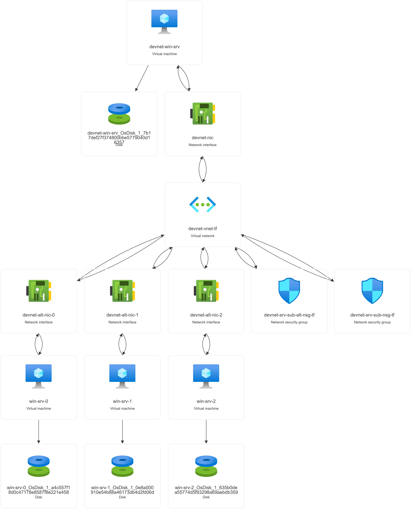

# Azure VM Deployment using Terraform

This Terraform configuration demonstrates the creation of multiple Azure Virtual Machines (VMs) inside a Virtual Network (`devnet-vnet-tf`) in two ways:

- **Single VM Deployment** — using a standard resource block.
- **Multiple VMs Deployment** — using the `count` meta-argument to dynamically create several instances.

## Operating System

All virtual machines are deployed with **Windows Server 2022** as the operating system.

## Topology Overview

The following architecture diagram represents the infrastructure components provisioned by this Terraform configuration:

### Components

- **Virtual Machines**
  - `devnet-win-srv`: A standalone Windows Server 2022 VM.
  - `win-srv-0`, `win-srv-1`, `win-srv-2`: Three Windows Server 2022 VMs created using the `count` meta-argument.

- **Network Interfaces**
  - Each VM is associated with its own NIC, named accordingly (e.g., `devnet-alt-nic-1`).

- **Disks**
  - Each VM has an OS disk provisioned.

- **Network Security Groups**
  - Two NSGs are applied to manage traffic: `devnet-srv-eub-all-nsg-tf` and `devnet-srv-eub-nsg-tf`.

- **Virtual Network**
  - All resources are deployed inside the `devnet-vnet-tf` VNet.

## Files Included

- `main.tf` — Contains the core VM and network resource definitions.
- `variables.tf` — Variables for parameterization.
- `outputs.tf` — Output values post-deployment.
- `devnet-cenin-tf-rg.png` — Topology diagram (shown above).

## Notes

- Ensure the Azure provider is authenticated before running `terraform plan` or `terraform apply`.
- VM extensions (like IIS installation) may require a `sleep` or wait mechanism to ensure VMs are in a `Running` state.

---

Feel free to customize or add deployment instructions as needed.
