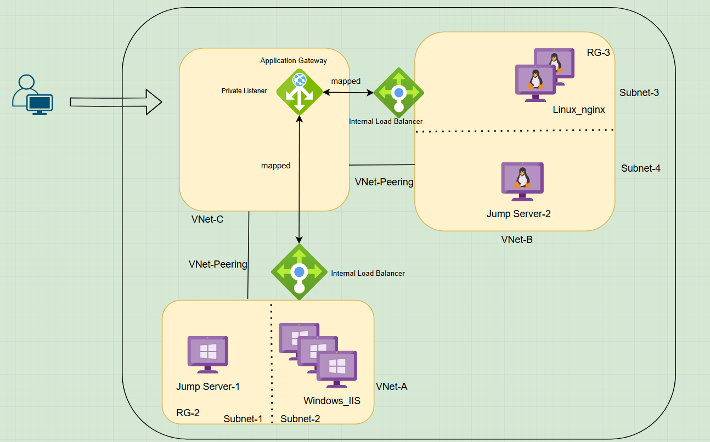

# 🚀 Azure Application Gateway with Private Listener and Multi-VNet Architecture

## 🧭 Overview

This Terraform project provisions a **multi-tiered, hub-and-spoke network architecture** in Azure, where:

- An **Application Gateway (AppGW)** is deployed with a **private listener**.
- AppGW routes traffic to two **Internal Load Balancers (ILBs)** deployed across **spoke VNets**.
- Behind each ILB are application servers (Windows IIS and Linux Nginx) in separate subnets and VNets.
- **Jump servers** are provisioned in each spoke for administrative access.
- **VNet peering** is fully configured to allow seamless traffic flow across VNets.

## 🧱 Architecture Components



| Layer | Resource | Description |
|-------|----------|-------------|
| **Hub** | Application Gateway (Private IP) | Routes traffic privately to internal services |
|        | VNet-C & Subnet | Hosting App Gateway and its subnet |
| **Spoke A** | ILB + Windows IIS VMs | Hosted in VNet-A with a jump box for RDP |
| **Spoke B** | ILB + Linux Nginx VMs | Hosted in VNet-B with a jump box for SSH |
| **VNet Peering** | Fully meshed | VNet-A, VNet-B, and VNet-C are peered bidirectionally |

## 📦 Modular Terraform Design

This architecture is implemented using a **modular approach** in Terraform. Each major component is encapsulated in its own independent module:

- `vm_windows_module/`
- `vm_linux_module/`
- `loadbalancer_module/`
- `application_gateway_module/`
- `load_balancer_module/`

## 🔄 Reusability Features

The solution is designed for scalability and reuse using the following Terraform meta-arguments:

- ✅ **`count`**: For provisioning multiple similar resources (e.g., VMs, NICs).
- ✅ **`for_each`**: To loop over maps or sets, useful for tagging, subnet definitions, and modular references.
- ✅ **`data "terraform_remote_state"`**: Each module fetches outputs from other modules (e.g., private IPs, VNet IDs) via remote state access.

This approach ensures **clean separation of concerns** and **module-level independence**, promoting easier testing and reuse.

## 🔒 Private Listener on App Gateway

The Application Gateway is configured with a **Private IP frontend listener**, which is mapped to both backend ILBs:

- Public IP is associated with the AppGW but not used.
- The frontend IP configuration uses a **static private IP address** from the AppGW subnet.
- Backend pools reference **internal IPs** of ILBs across peered VNets.

## 🔗 VNet Peering

Full VNet peering is configured as follows:

- VNet-A ⇄ VNet-C  
- VNet-B ⇄ VNet-C  

This allows App Gateway in the hub to privately route traffic to both spokes.

## 🛠️ How to Use

1. Configure your backend state for each module.
2. Apply each module individually in order:
   - Jump Servers
   - Load Balancers
   - Linux and Windows VMs
   - Application Gateway + VNet peering
3. Ensure peering and route tables (if needed) are correctly applied.

## 📁 Remote State Files

Remote state is used to reference outputs from other independently deployed modules.

Example:
```hcl
data "terraform_remote_state" "calling_hub_lnx_resources" {
  backend = "azurerm"
  config = {
    resource_group_name  = "resource_group_name"
    storage_account_name = "storagename"
    container_name       = "containername"
    key                  = "blobname"
  }
}
```

## ✅ Validation Checklist

- [x] App Gateway has both frontend IPs (public/private) if needed.
- [x] Private listener is correctly bound to static IP.
- [x] VNet peering completed between hub and spokes.
- [x] ILBs receive traffic from AppGW using backend pool config.
- [x] Modular code uses remote state, count, and for_each.
